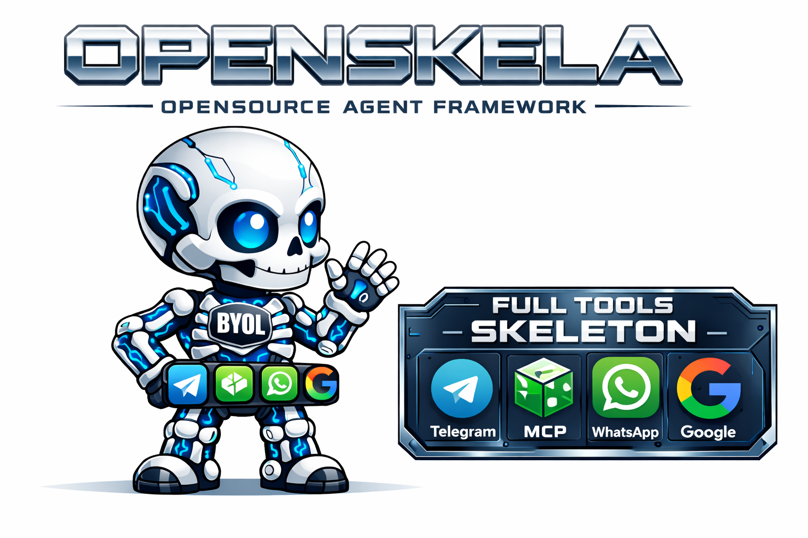

<div align="center">
  
  <p align="center">
    <strong>OpenSkela</strong> is the structural foundation for production-grade agentic environments. 
    <br />
    <em>Intelligent. Secure. Autonomous. Self-Forging.</em>
  </p>
  <p align="center">
    <a href="https://github.com/inareshmatta/openskela/blob/main/LICENSE"></a>
    <a href="https://github.com/inareshmatta/openskela/stargazers"></a>
    <a href="https://github.com/pnpm/pnpm"></a>
    <a href="https://turbo.build/"></a>
  </p>
</div>

---

# 🦴 OpenSkela: The Open Source Agent Operating System

OpenSkela (short for "Open Skeleton") is not just another wrapper for LLM calls. It is a **production-grade Agentic Operating System (AOS)** designed to provide the structural foundation for building, deploying, and managing fleets of autonomous agents.

From self-forging tools that agents write themselves to hardware-like "Reasoning Interrupts" and multi-tenant RBAC, OpenSkela treats the LLM as a CPU kernel and surrounds it with the necessary subsystems to perform complex, safe, and cost-effective work in the real world.

> [!IMPORTANT]
> **BYOL (Bring Your Own LLM)**: OpenSkela is model-agnostic. Plug in Claude for coding, Grok for real-time news, and Gemini for shopping — all within the same session.

---

## 🚀 Key Architectural Pillars

### 🧠 1. SMMU: Semantic Memory Management Unit
We treat the LLM's context window like physical RAM. Just as a traditional OS uses paging and virtual memory, OpenSkela’s SMMU manages "Cognitive Layers":
- **L1 (Active Attention)**: The immediate context window containing hot thoughts and active instructions.
- **L2 (Deep Context)**: A warm store containing semantic slices that are swapped into L1 only when needed.
- **Context Indexing**: Instead of sending full, redundant conversation history, SMMU uses a lightweight YAML index that only retrieves relevant segments, saving up to 80% on token costs.

### 🛠️ 2. ToolForge: The Self-Forging Tool Engine
The most powerful feature of OpenSkela. When an agent encounters a problem it doesn't have a tool for, it enters the **Forge Pipeline**:
1. **Research**: It searches the web for APIs, SDKs, or npm/pypi packages.
2. **Authoring**: It writes its own tool code in Python, TypeScript, or JavaScript.
3. **WASM Testing**: It executes the new tool in a gas-metered WebAssembly sandbox, iterating up to 10 times until it passes its own test suite.
4. **Hot Registration**: The tool is registered live into the `ToolRegistry` and persisted for all future agents.
5. **AutoForge Detector**: TYPO? Missing Tool? The detector intercepts the `TOOL_NOT_FOUND` error and triggers a forge transparently.

### 🛡️ 3. Multi-Layer Security Sandbox
OpenSkela is designed for "Untrusted Agent Execution."
- **WASM Dual-Metering**: Tools run in Wasmer with fuel metering. Runaway loops are killed instantly.
- **Taint Tracking**: Sensitive data tagged as `Secret` is tracked through the reasoning thread. If an agent tries to push a "Tainted" secret to an untrusted output (like a public API), the OS blocks it.
- **Merkle Audit Chains**: Every tool call is cryptographically linked to the previous. If any log entry is tampered with, the audit chain breaks.
- **Dangerous Command Guard**: Terminal-level detection for `rm -rf /`, `chmod 777`, and `curl | bash` with hard approval gates.

---

## 💎 Features at a Glance

### 👥 Multi-Tenancy & RBAC
Built for teams and enterprises.
- **Organizations**: Group users, agents, and API keys.
- **Cost Budgets**: Set hard daily/monthly USD limits per organization.
- **Granular RBAC**: "agents.create", "tools.trading", "memory.delete" — allow only what's necessary.
- **Hashed API Keys**: Secure key management with scoped prefixes (e.g., `osk_live_...`).

### 📊 Advanced Multi-LLM Routing
One LLM is never enough.
- **Dual-Model Consensus**: Trading decisions use Claude (Fundamentals) + Grok (Real-time Sentiment) with a voting mechanism.
- **Capability Routing**: Automatically routes tasks like "Frontend Gen" to Gemini and "Security Review" to Claude.
- **LLM Pool**: Run up to 4 models simultaneously in a single orchestrator loop.

### 🧬 Hybrid Memory Layer
- **Short-Term (Redis)**: Volatile session state.
- **Long-Term (Postgres)**: Permanent fact storage.
- **Vector (Qdrant)**: Semantic search over documents and history.
- **Graph (FalkorDB)**: Relationship and entity mapping for deep reasoning.

### 🎤 Multimodal & Multi-Channel
- **Voice STT**: Automatic transcription of voice messages from WhatsApp, Telegram, or Discord via Whisper.
- **Platform-Aware TTS**: Get voice bubbles on Telegram (Opus), audio files on Discord, and local playbacks on CLI.
- **Canonical Sessions**: Chat on WhatsApp, continue on Telegram — your session and memory follow you.

---

## 🛠️ Execution Backends: The "Hypervisors"

OpenSkela supports five distinct execution environments for agent commands:
1. **Local**: Direct execution (for development).
2. **Docker**: Isolated containerized environments.
3. **SSH**: Execute on a remote machine (Agent cannot modify its own host code).
4. **Modal**: Serverless cloud execution with persistent workspace snapshots.
5. **Singularity**: High Performance Computing (HPC) for heavy data workloads.

---

## 📦 Package Ecosystem

OpenSkela is a monorepo managed by **Turborepo** + **pnpm**.

| Package | Purpose |
| :--- | :--- |
| `@openskela/core` | The AOS Kernel. Agent orchestration, Spawner, and Runtime State. |
| `@openskela/adapters` | Multi-LLM adapter layer (Anthropic, OpenAI, Google, Grok, Ollama). |
| `@openskela/tools` | 60+ industry-standard tools and the Authorizer gate. |
| `@openskela/memory` | Unified API for Hybrid (Vector, Graph, SQL, Redis) memory. |
| `@openskela/context` | YAML Indexing, Token Budgeting, and Segment Caching. |
| `@openskela/security` | WASM Sandbox, Taint Tracking, and Audit Logging. |
| `@openskela/trading` | Consensus algorithms and paper-trading portfolio management. |
| `@openskela/app-builder` | Autonomous developer agent for full app deployment. |
| `@openskela/mcp` | generic Model Context Protocol support. |
| `@openskela/observability` | Structured pino logging and OpenTelemetry tracing. |

---

## 🌈 The OS Metaphor: Hardware vs. Software

| OS Concept | OpenSkela Equivalent |
| :--- | :--- |
| **CPU Kernel** | LLM Reasoning Loop |
| **RAM / Paging** | SMMU & Context Segment Cache |
| **File System** | Hybrid Memory (Vector + Long-term) |
| **Peripherals** | Tool Registry (WhatsApp, Trading, Browser) |
| **Drivers** | Provider Adapters (Claude, OpenAI) |
| **Admin Console** | Control Panel (Toggles for features) |
| **Shell** | Slash Commands in Chat |

---

## ⚡ Quick Start

### 1. The Wizard (Recommended)
The easiest way for non-technical users to get started. installs everything including DBs.
```bash
pip install openskela
openskela wizard
```

### 2. Manual Monorepo Setup (For Developers)
Requires Node 20+ and pnpm.
```bash
# Clone the repo
git clone https://github.com/inareshmatta/openskela.git
cd openskela

# Install dependencies
pnpm install

# Configure environment
cp .env.example .env

# Build everything
pnpm run build
```

---

## 🤖 Example Slash Commands
Commands you can run directly in the chat to control the OS:
- `/pair <code>` - Pair your mobile device.
- `/settings set trading.enabled true` - Toggle feature-gates instantly.
- `/cron add "every 9am" "Check my portfolio"` - Create natural language cron jobs.
- `/mode assist` - Switch to "Human-in-the-loop" approval mode.
- `/search "that conversation about Tesla"` - Semantic search across past sessions.

---

## 🗺️ Roadmap
- [x] Core Kernel & Spawner
- [x] Multi-LLM Routing
- [x] Multi-Tenant RBAC
- [x] Hybrid Memory Layer
- [ ] ToolForge Self-Creation (In Development)
- [ ] Voice/STT Integration
- [ ] SSH Terminal Backend
- [ ] Skills Marketplace

## 🤝 Contributing
OpenSkela is built by the community. See [CONTRIBUTING.md](./CONTRIBUTING.md) for local dev setup, coding standards, and our RFC process.

## 📄 License
OpenSkela is available under the **Apache 2.0 License**.

---
<div align="center">
  Built with ❤️ for the future of Autonomous Intelligence.
</div>
